<div align="center">

<p><strong>MESSENGER FOR MODERN TEAMS</strong></p>

# 회사의 대화와 하루를 하나로.

### 메신저 따로, 조직도 따로, 출퇴근 따로 관리하지 마세요.

Messenger는 팀 커뮤니케이션과 근태 흐름을 한 화면에 연결하는<br />실시간 사내 협업 솔루션입니다.

<br />

[**5분 만에 데모 시작하기**](#5분-데모)　·　[**핵심 기능 살펴보기**](#팀에-필요한-기능을-한곳에)　·　[**기술 문서 보기**](./messenger-mvp/README.md)

<br />

[](https://react.dev/)
[](https://www.typescriptlang.org/)
[](https://socket.io/)

</div>

---

## 업무는 연결되어 있는데, 도구는 왜 흩어져 있을까요?

중요한 대화는 개인 메신저에 남고, 파일은 다른 서비스에 흩어지고, 출퇴근 현황은 또 다른 시스템에서 확인합니다. 팀이 커질수록 사람들은 더 많은 화면을 오가고, 정작 필요한 맥락은 놓치게 됩니다.

Messenger는 이 단절을 하나의 자연스러운 업무 흐름으로 바꿉니다.

| 기존의 업무 방식 | Messenger와 함께라면 |
|---|---|
| 개인 메신저와 업무 채널이 뒤섞임 | 1:1 DM과 그룹 채널을 명확하게 분리 |
| 답장이 쌓일수록 대화 맥락을 잃음 | 스레드로 주제별 논의를 깔끔하게 유지 |
| 누가 자리에 있는지 매번 물어봄 | 온라인·자리비움·방해금지 상태를 즉시 확인 |
| 공지와 결정 사항이 메시지 속에 묻힘 | 중요한 메시지를 고정해 팀 전체가 빠르게 확인 |
| 출퇴근과 팀 현황을 별도 도구로 관리 | 체크인부터 팀 근태 현황까지 한 화면에서 처리 |

> **더 적게 전환하고, 더 빠르게 이해하고, 팀의 하루에 집중하세요.**

## 팀에 필요한 기능을 한곳에

<table>
<tr>
<td width="33%" valign="top">
<h3>💬 대화가 업무가 되도록</h3>
<p>1:1 DM과 그룹 채널, 스레드 답장으로 대화의 맥락을 지킵니다. 읽지 않은 메시지와 타이핑 상태가 실시간으로 동기화되어 대화가 끊기지 않습니다.</p>
</td>
<td width="33%" valign="top">
<h3>📌 중요한 정보가 남도록</h3>
<p>파일과 이미지를 바로 공유하고, 핵심 메시지는 채널 상단에 고정하세요. 전체 검색과 <code>@멘션</code>으로 필요한 사람과 정보를 빠르게 찾을 수 있습니다.</p>
</td>
<td width="33%" valign="top">
<h3>🕘 팀의 하루가 보이도록</h3>
<p>출근과 퇴근을 간단히 기록하고 오늘의 팀 현황을 실시간으로 확인합니다. 개인의 최근 기록과 근무시간도 한곳에서 볼 수 있습니다.</p>
</td>
</tr>
</table>

### 실시간 커뮤니케이션

- 1:1 다이렉트 메시지와 멤버 기반 그룹 채널
- 온라인·자리비움·방해금지 상태와 커스텀 상태 메시지
- 타이핑 표시, 읽지 않은 메시지, 브라우저 데스크톱 알림
- 메시지 수정·소프트 삭제와 빠른 이모지 반응

### 정보와 맥락 관리

- 대화를 분리하는 1단계 스레드
- 중요한 메시지 고정과 채널별 고정 메시지 모아보기
- 참여 중인 모든 채널의 메시지 검색
- 채널 멤버 `@멘션` 자동완성과 본인 멘션 강조
- 최대 20MB 파일 업로드와 이미지 인라인 미리보기

### 팀 운영

- 부서별 조직도와 클릭 한 번으로 시작하는 DM
- 그룹 채널 멤버 추가, 채널 나가기와 알림 음소거
- 출근·퇴근 체크와 최근 개인 근태 기록
- 모든 구성원의 오늘 근태 현황 실시간 갱신
- 라이트·다크 테마와 반응형 인터페이스

## 팀의 하루가 자연스럽게 이어집니다

```mermaid
flowchart LR
    A[출근 체크] --> B[팀 상태 확인]
    B --> C[동료와 DM]
    C --> D[그룹 채널 협업]
    D --> E[스레드로 의사결정]
    E --> F[중요 메시지 고정]
    F --> G[퇴근 체크]

    style A fill:#ededff,stroke:#5b5bd6,color:#20232a
    style B fill:#f8f9fb,stroke:#d9dce2,color:#20232a
    style C fill:#f8f9fb,stroke:#d9dce2,color:#20232a
    style D fill:#ededff,stroke:#5b5bd6,color:#20232a
    style E fill:#f8f9fb,stroke:#d9dce2,color:#20232a
    style F fill:#f8f9fb,stroke:#d9dce2,color:#20232a
    style G fill:#ededff,stroke:#5b5bd6,color:#20232a
```



대화를 위한 도구가 아니라, **출근부터 협업과 의사결정, 퇴근까지 이어지는 팀의 업무 공간**을 지향합니다.

## Messenger가 잘 맞는 팀

| 팀 | 얻을 수 있는 가치 |
|---|---|
| 빠르게 성장하는 스타트업 | 복잡한 도입 과정 없이 팀 커뮤니케이션 기반을 빠르게 구축 |
| 사내 도구를 직접 운영하려는 조직 | 데이터와 운영 환경을 직접 통제할 수 있는 셀프 호스팅 기반 |
| 프로젝트 중심의 소규모 팀 | 채널과 스레드로 업무 맥락을 분리하고 결정 사항을 보존 |
| 근태와 소통을 함께 관리하려는 팀 | 메신저와 출퇴근 현황을 한 화면에서 확인 |
| 사내 협업 제품을 검증하는 개발팀 | 인증·실시간 통신·권한·저장소가 연결된 확장 가능한 MVP |

## 작게 시작하고, 팀과 함께 확장하세요

Messenger는 별도의 데이터베이스 서버 없이 바로 실행할 수 있습니다. 동시에 인증, 채널 권한, 실시간 룸, 메시지 영속화처럼 제품 운영에 필요한 핵심 경계를 이미 분리해 두었습니다.

| 지금 바로 제공 | 성장 단계에서 확장 |
|---|---|
| SQLite 기반 간편한 로컬 실행 | PostgreSQL 기반 다중 인스턴스 운영 |
| 로컬 파일 업로드 | S3 호환 오브젝트 스토리지와 CDN |
| 이메일·비밀번호 인증 | 사내 SSO, LDAP, AD 연동 |
| 기본 메시지 검색 | 전문 검색 엔진과 고급 필터 |
| 실시간 웹 애플리케이션 | 모바일·데스크톱 클라이언트 |

### 제품을 구성하는 기반

```text
React + TypeScript + Vite
        ↓ REST / Socket.IO
Node.js + Express + JWT
        ↓
SQLite + Local File Storage
```

구현 구조, API, Socket.IO 이벤트, 환경 변수와 보안 설계는 [상세 기술 문서](./messenger-mvp/README.md)에서 확인할 수 있습니다.

## 5분 데모

두 개의 터미널만 준비하면 됩니다.

**터미널 1 — 서버**

```bash
cd messenger-mvp/server
npm install
npm run seed
npm run dev
```

**터미널 2 — 클라이언트**

```bash
cd messenger-mvp/client
npm install
npm run dev
```

브라우저에서 [`http://localhost:5173`](http://localhost:5173)을 열고 아래 데모 계정으로 로그인하세요.

| 역할 | 이메일 | 비밀번호 |
|---|---|---|
| 관리자 데모 | `admin@example.com` | `password123` |
| 개발팀 데모 | `dev1@example.com` | `password123` |
| 디자인팀 데모 | `design1@example.com` | `password123` |

서로 다른 브라우저나 시크릿 창에서 두 계정으로 로그인하면 메시지, 타이핑, 온라인 상태와 근태 현황이 실시간으로 동기화되는 모습을 확인할 수 있습니다.

<div align="center">

## 이제 팀의 대화가 업무의 흐름이 됩니다.

설치부터 첫 메시지까지 단 몇 분.<br />Messenger로 더 연결된 팀의 하루를 시작하세요.

<br />

[**지금 데모 시작하기 →**](#5분-데모)　　[**상세 기술 문서 →**](./messenger-mvp/README.md)

<br />

**Messenger · One workspace for every team moment**

</div>
