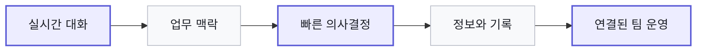

<div align="center">

<br />

`TEAM COMMUNICATION`　`ATTENDANCE`　`REAL TIME`

<br />

# 회사의 대화와 하루를 하나로.

### Messenger

메신저 따로, 조직도 따로, 출퇴근 따로 관리하던 업무를<br />하나의 자연스러운 흐름으로 연결합니다.

<br />

[**▶ 5분 데모 시작하기**](#07--try-it-now)　　[**제품 기능 보기**](#03--product)　　[**기술 문서 보기**](./messenger-mvp/README.md)

<br />

[](https://react.dev/)
[](https://www.typescriptlang.org/)
[](https://socket.io/)

<br />
<br />

**One workspace. Every team moment.**

<br />

</div>

---

<div align="center">

## 01 · THE PROBLEM

# 도구는 늘었는데,
# 팀의 맥락은 더 흩어졌습니다.

<br />

</div>

<table>
<tr>
<td width="33%" align="center">
<h3>💬 대화는 메신저에</h3>
<p>중요한 결정이 수많은 메시지 사이로 사라집니다.</p>
</td>
<td width="33%" align="center">
<h3>📁 자료는 여기저기에</h3>
<p>파일과 맥락을 찾기 위해 여러 화면을 오갑니다.</p>
</td>
<td width="33%" align="center">
<h3>🕘 근태는 또 다른 곳에</h3>
<p>누가 일하고 있는지 확인하는 데도 시간이 듭니다.</p>
</td>
</tr>
</table>

<div align="center">

<br />

### 팀이 필요한 것은 더 많은 도구가 아니라,
## 끊기지 않는 하나의 업무 경험입니다.

<br />

</div>

---

<div align="center">

## 02 · THE SOLUTION

# 대화에서 업무로.
# 출근에서 퇴근까지.

Messenger는 팀의 모든 순간을 하나의 화면에 연결합니다.

<br />

</div>

| BEFORE | → | WITH MESSENGER |
|:---:|:---:|:---:|
| 개인 메신저와 업무 채널 혼재 | **정리** | 1:1 DM과 그룹 채널 분리 |
| 답장이 쌓일수록 맥락 손실 | **집중** | 스레드로 주제별 논의 유지 |
| 공지와 결정 사항이 대화 속에 묻힘 | **보존** | 핵심 메시지 고정 |
| 동료의 상태를 매번 질문 | **가시성** | 온라인·자리비움·방해금지 표시 |
| 별도 근태 시스템을 오가며 확인 | **연결** | 출퇴근과 팀 현황 통합 |

<br />

> [!TIP]
> **더 적게 전환하고, 더 빠르게 이해하고, 진짜 업무에 집중하세요.**

<br />

---

<div align="center">

## 03 · PRODUCT

# 세 가지 경험.
# 하나의 Messenger.

<br />

</div>

<table>
<tr>
<td width="33%" valign="top" align="center">
<h2>01</h2>
<h3>REAL-TIME CHAT</h3>
<p><strong>대화가 끊기지 않도록</strong></p>
<p>1:1 DM · 그룹 채널<br />타이핑 · 읽음 상태<br />이모지 반응 · 알림</p>
</td>
<td width="33%" valign="top" align="center">
<h2>02</h2>
<h3>KNOWLEDGE FLOW</h3>
<p><strong>맥락이 사라지지 않도록</strong></p>
<p>스레드 · 메시지 고정<br />전체 검색 · @멘션<br />파일 · 이미지 공유</p>
</td>
<td width="33%" valign="top" align="center">
<h2>03</h2>
<h3>TEAM OPERATION</h3>
<p><strong>팀의 하루가 보이도록</strong></p>
<p>조직도 · 사용자 상태<br />출근 · 퇴근 체크<br />팀 실시간 근태 현황</p>
</td>
</tr>
</table>

<br />



<br />

---

<div align="center">

## 04 · A DAY WITH MESSENGER

# 팀의 하루가 자연스럽게 이어집니다.

<br />

`09:00`　**출근 체크**

↓

`09:10`　**팀 상태 확인**

↓

`10:30`　**동료와 DM**

↓

`14:00`　**그룹 채널 협업**

↓

`16:20`　**스레드에서 의사결정**

↓

`17:30`　**핵심 메시지 고정**

↓

`18:00`　**퇴근 체크**

<br />

### 대화 도구를 넘어,
## 팀의 업무가 머무는 공간으로.

<br />

</div>

---

<div align="center">

## 05 · WHY MESSENGER

# 빠르게 시작하고,
# 팀과 함께 성장합니다.

<br />

</div>

<table>
<tr>
<td width="25%" align="center" valign="top">
<h3>⚡ 빠른 도입</h3>
<p>별도 DB 서버 없이 몇 분 안에 시작</p>
</td>
<td width="25%" align="center" valign="top">
<h3>🔒 직접 통제</h3>
<p>데이터와 운영 환경을 소유하는 셀프 호스팅</p>
</td>
<td width="25%" align="center" valign="top">
<h3>🔄 진짜 실시간</h3>
<p>메시지부터 상태와 근태까지 즉시 동기화</p>
</td>
<td width="25%" align="center" valign="top">
<h3>↗ 확장 가능</h3>
<p>PostgreSQL·SSO·오브젝트 스토리지로 확장</p>
</td>
</tr>
</table>

<br />

| 지금 바로 | 성장 단계에서 |
|---|---|
| SQLite 기반 간편 실행 | PostgreSQL과 다중 인스턴스 |
| 로컬 파일 업로드 | S3 호환 스토리지와 CDN |
| 이메일·비밀번호 인증 | 사내 SSO · LDAP · AD |
| 기본 메시지 검색 | 전문 검색과 고급 필터 |
| 반응형 웹 애플리케이션 | 모바일 · 데스크톱 클라이언트 |

<br />

---

<div align="center">

## 06 · BUILT FOR

# 이런 팀이라면 더 잘 맞습니다.

<br />

</div>

| | 팀 | Messenger가 만드는 변화 |
|:---:|---|---|
| 🚀 | **빠르게 성장하는 스타트업** | 복잡한 도입 없이 협업 기반을 빠르게 구축 |
| 🏢 | **사내 도구를 직접 운영하는 조직** | 커뮤니케이션 데이터와 환경을 직접 통제 |
| 🎯 | **프로젝트 중심의 소규모 팀** | 채널과 스레드로 맥락과 결정 사항을 보존 |
| 🧑‍💻 | **제품을 검증하는 개발팀** | 인증·실시간·권한·저장소가 연결된 완성형 MVP |

<br />

```text
React + TypeScript + Vite
             ↓
      REST + Socket.IO
             ↓
Node.js + Express + JWT
             ↓
  SQLite + File Storage
```

<div align="center">

API, 실시간 이벤트, 데이터 구조와 보안 설계는<br />[**상세 기술 문서에서 확인하세요 →**](./messenger-mvp/README.md)

<br />

</div>

---

<div align="center">

## 07 · TRY IT NOW

# 첫 메시지까지 단 5분.

두 개의 터미널로 Messenger를 바로 경험하세요.

<br />

</div>

<table>
<tr>
<td width="50%" valign="top">
<p><strong>TERMINAL 01 · SERVER</strong></p>
<pre><code>
cd messenger-mvp/server
npm install
npm run seed
npm run dev
</code></pre>
</td>
<td width="50%" valign="top">
<p><strong>TERMINAL 02 · CLIENT</strong></p>
<pre><code>
cd messenger-mvp/client
npm install
npm run dev
</code></pre>
</td>
</tr>
</table>

<div align="center">

브라우저에서 **http://localhost:5173**을 열어주세요.

<br />

<table>
<tr><th>DEMO ROLE</th><th>EMAIL</th><th>PASSWORD</th></tr>
<tr><td>관리자</td><td><code>admin@example.com</code></td><td><code>password123</code></td></tr>
<tr><td>개발팀</td><td><code>dev1@example.com</code></td><td><code>password123</code></td></tr>
<tr><td>디자인팀</td><td><code>design1@example.com</code></td><td><code>password123</code></td></tr>
</table>

<br />

서로 다른 브라우저에서 두 계정으로 로그인하면<br />메시지, 타이핑, 온라인 상태와 근태 현황이 실시간으로 연결됩니다.

<br />
<br />

# 이제 팀의 대화가
# 업무의 흐름이 됩니다.

설치부터 첫 메시지까지 단 몇 분.<br />더 연결된 팀의 하루를 시작하세요.

<br />

[**▶ 지금 데모 시작하기**](#07--try-it-now)　　[**상세 기술 문서 →**](./messenger-mvp/README.md)

<br />

**MESSENGER**

*One workspace for every team moment.*

<br />

</div>
