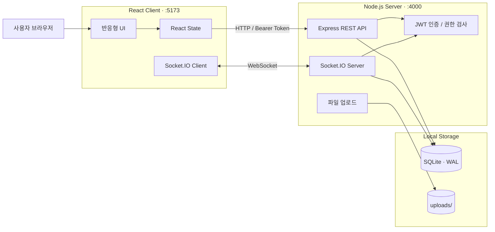

<div align="center">

# Messenger

### 팀의 대화와 근태를 한곳에 모은 실시간 사내 메신저

React와 Socket.IO로 구현한 풀스택 MVP입니다. 1:1 메시지부터 그룹 채널, 스레드, 파일 공유, 멘션, 출퇴근 기록까지 실제 협업 흐름을 하나의 제품으로 연결합니다.

[](https://react.dev/)
[](https://www.typescriptlang.org/)
[](https://nodejs.org/)
[](https://socket.io/)
[](https://www.sqlite.org/)

**실시간 메시징 · 조직도 · 그룹 채널 · 파일 공유 · 스레드 · 출퇴근 관리**

</div>

---

## 프로젝트 소개

Messenger는 사내 커뮤니케이션의 핵심 흐름을 빠르게 검증하기 위한 수직 슬라이스입니다. 별도의 데이터베이스 서버 없이 로컬에서 바로 실행할 수 있으면서도, 인증·권한·실시간 상태 동기화·영속 저장소까지 갖춘 실제 동작하는 애플리케이션입니다.

| 커뮤니케이션 | 협업 경험 | 조직 운영 |
|:---|:---|:---|
| 1:1 DM과 그룹 채널 | 스레드와 이모지 반응 | 부서별 조직도 |
| 실시간 메시지와 프레즌스 | 파일·이미지 공유, 메시지 고정 | 출퇴근 체크인/체크아웃 |
| 읽음 상태와 알림 배지 | 검색과 `@멘션` | 팀 실시간 근태 현황 |
| 커스텀 상태(자리비움/방해금지) | 채널 음소거, 프로필 관리 | 시드 계정 기반 빠른 온보딩 |

## 주요 기능

### 메시징

- **실시간 대화** — Socket.IO 기반 메시지 송수신과 채널별 이력 보존
- **1:1 DM / 그룹 채널** — 조직도에서 동료를 선택하거나 멤버를 초대해 채널 생성
- **스레드 답장** — 원본 메시지의 맥락을 유지하는 1단계 스레드
- **수정과 삭제** — 본인 메시지만 수정 가능하며 삭제는 소프트 삭제로 처리
- **이모지 반응** — 빠른 반응과 참여 인원 수를 실시간 동기화
- **파일 공유** — 최대 20MB 업로드, 이미지 인라인 미리보기와 일반 파일 다운로드
- **메시지 검색** — 참여 중인 채널의 메시지를 검색하고 원문 위치로 이동
- **페이지네이션** — 최근 50개를 먼저 불러오고 이전 메시지를 점진적으로 조회

### 협업 경험

- **온라인 상태와 타이핑 표시** — 사용자별 프레즌스와 입력 상태 실시간 반영
- **커스텀 상태** — 온라인 / 자리비움 / 방해금지와 자유 상태 메시지, DM 상대 화면에 실시간 반영
- **읽지 않은 메시지** — 채널별 읽음 시각을 기준으로 배지 계산
- **`@멘션` 자동완성** — 채널 멤버 검색과 본인 멘션 강조
- **메시지 고정** — 채널 상단 고정 바에서 중요한 메시지를 모아보기
- **채널 알림 끄기** — 채널별로 브라우저 알림만 선택적으로 음소거
- **브라우저 알림** — 비활성 탭 또는 다른 채널 이용 중 새 메시지 알림(음소거 채널 제외)
- **그룹 멤버 관리** — 생성 후 멤버 추가와 채널 나가기 지원
- **프로필 관리** — 이름·부서 수정과 비밀번호 변경
- **라이트 / 다크 모드** — 로컬에 테마 설정 저장
- **반응형 UI** — 작은 화면에서는 탐색 영역을 압축해 대화 공간 확보

### 근태

- **출근 / 퇴근 기록** — 하루 단위 체크인과 체크아웃
- **팀 현황판** — 전 직원의 오늘 상태를 실시간으로 동기화
- **개인 기록** — 최근 근태 이력과 근무시간 계산

## 빠른 시작

### 준비 사항

- [Node.js](https://nodejs.org/) 20 이상 권장
- npm 10 이상 권장
- 서버와 클라이언트용 터미널 각 1개

### 1. 서버 실행

```bash
cd server
npm install
npm run seed
npm run dev
```

서버는 기본적으로 `http://localhost:4000`에서 실행됩니다. `npm run seed`는 여러 번 실행해도 이미 존재하는 계정을 중복 생성하지 않습니다.

### 2. 클라이언트 실행

새 터미널에서 실행합니다.

```bash
cd client
npm install
npm run dev
```

브라우저에서 `http://localhost:5173`을 열면 됩니다. 서로 다른 브라우저나 시크릿 창으로 두 계정에 로그인하면 실시간 메시징과 프레즌스를 바로 확인할 수 있습니다.

<details>
<summary><strong>데모 계정 보기</strong></summary>

모든 데모 계정의 비밀번호는 `password123`입니다.

| 이메일 | 이름 | 부서 |
|---|---|---|
| `admin@example.com` | 김관리 | 경영지원팀 |
| `dev1@example.com` | 이개발 | 개발팀 |
| `dev2@example.com` | 박코딩 | 개발팀 |
| `design1@example.com` | 최디자인 | 디자인팀 |
| `sales1@example.com` | 정영업 | 영업팀 |

시드 실행 시 모든 데모 사용자가 참여하는 `전체 공지` 채널도 함께 생성됩니다.

</details>

## 시스템 구성



클라이언트는 초기 데이터 조회와 파일 업로드에 REST API를 사용하고, 메시지·프레즌스·타이핑·근태 변경처럼 즉시 반영되어야 하는 상태는 Socket.IO로 동기화합니다.

## 기술 스택

| 영역 | 기술 | 선택 이유 |
|---|---|---|
| UI | React 18, TypeScript | 컴포넌트 기반 UI와 정적 타입 안정성 |
| 빌드 | Vite 5 | 빠른 개발 서버와 간결한 프로덕션 빌드 |
| 실시간 통신 | Socket.IO 4 | 룸 기반 채널 브로드캐스트와 재연결 처리 |
| HTTP 서버 | Express 4 | 작은 REST API를 빠르게 구성 |
| 인증 | JWT, bcryptjs | 무상태 인증과 비밀번호 해시 저장 |
| 데이터베이스 | SQLite, better-sqlite3 | 외부 DB 없이 즉시 실행 가능한 영속 저장소 |
| 파일 업로드 | Multer | multipart 업로드와 로컬 파일 저장 |

## 데이터 흐름

### 메시지를 보낼 때

1. 클라이언트가 JWT로 인증된 Socket.IO 연결을 생성합니다.
2. `message:send` 이벤트로 채널, 본문, 첨부 정보를 전송합니다.
3. 서버가 입력과 채널 멤버십을 검증합니다.
4. 메시지를 SQLite에 저장합니다.
5. 해당 채널 룸에 `message:new` 이벤트를 브로드캐스트합니다.
6. 참여 중인 모든 클라이언트가 같은 메시지 상태를 반영합니다.

### 읽지 않은 메시지를 계산할 때

각 채널 멤버의 `last_read_at` 이후에 생성된 다른 사용자의 메시지를 계산합니다. 채널을 열면 REST와 Socket 이벤트를 통해 읽음 시각이 갱신됩니다.

## 프로젝트 구조

```text
messenger-mvp/
├─ client/
│  ├─ src/
│  │  ├─ components/       # 채팅, 스레드, 검색, 근태, 모달 UI
│  │  ├─ context/          # 인증 상태와 세션 복원
│  │  ├─ pages/            # 로그인과 메인 화면
│  │  ├─ api.ts            # REST API 클라이언트
│  │  ├─ socket.ts         # Socket.IO 연결 관리
│  │  ├─ types.ts          # 공유 프런트엔드 타입
│  │  └─ styles.css        # 디자인 토큰과 반응형 스타일
│  ├─ package.json
│  └─ vite.config.ts
├─ server/
│  ├─ src/
│  │  ├─ routes/           # 인증, 사용자, 채널, 검색, 업로드, 근태 API
│  │  ├─ auth.js           # JWT 생성과 인증 미들웨어
│  │  ├─ db.js             # SQLite 스키마와 데이터 접근 계층
│  │  ├─ socket.js         # 실시간 이벤트와 룸 관리
│  │  ├─ seed.js           # 데모 사용자와 채널 생성
│  │  └─ index.js          # 서버 진입점
│  └─ package.json
└─ README.md
```

런타임에 생성되는 `server/data/`와 `server/uploads/`는 Git에 포함되지 않습니다.

## 환경 변수

별도 설정 없이 로컬 기본값으로 실행할 수 있습니다. 운영 또는 공유 환경에서는 반드시 값을 명시하세요.

### Server

| 변수 | 기본값 | 설명 |
|---|---|---|
| `PORT` | `4000` | HTTP 및 Socket.IO 서버 포트 |
| `CLIENT_ORIGIN` | `http://localhost:5173` | CORS를 허용할 클라이언트 Origin |
| `JWT_SECRET` | 개발용 기본 문자열 | JWT 서명 키. 운영 환경에서는 반드시 강한 값으로 교체 |

### Client

| 변수 | 기본값 | 설명 |
|---|---|---|
| `VITE_API_URL` | `http://localhost:4000` | REST API와 Socket.IO 서버 주소 |

PowerShell 예시:

```powershell
$env:JWT_SECRET="replace-with-a-long-random-secret"
$env:CLIENT_ORIGIN="http://localhost:5173"
npm.cmd run dev
```

## API 개요

보호된 REST API는 `Authorization: Bearer <token>` 헤더가 필요합니다.

<details>
<summary><strong>REST 엔드포인트 보기</strong></summary>

| Method | Endpoint | 역할 |
|---|---|---|
| `POST` | `/api/auth/register` | 회원가입 |
| `POST` | `/api/auth/login` | 로그인과 JWT 발급 |
| `GET` | `/api/auth/me` | 현재 사용자 조회 |
| `PATCH` | `/api/auth/me` | 이름·부서 수정 |
| `POST` | `/api/auth/change-password` | 비밀번호 변경 |
| `GET` | `/api/users` | 조직도 사용자 목록 |
| `GET` | `/api/channels` | 참여 채널과 읽지 않은 메시지 조회 |
| `POST` | `/api/channels` | DM 또는 그룹 채널 생성 |
| `GET` | `/api/channels/:id/messages` | 메시지 페이지 조회 |
| `GET` | `/api/channels/:id/messages/:messageId/thread` | 스레드 조회 |
| `POST` | `/api/channels/:id/read` | 채널 읽음 처리 |
| `POST` | `/api/channels/:id/members` | 그룹 멤버 추가 |
| `DELETE` | `/api/channels/:id/members/me` | 그룹 채널 나가기 |
| `GET` | `/api/channels/:id/pinned` | 채널 고정 메시지 목록 |
| `POST` | `/api/channels/:id/mute` | 채널 알림 음소거 설정 |
| `GET` | `/api/search?q=...` | 참여 채널 메시지 검색 |
| `POST` | `/api/uploads` | 파일 업로드 |
| `GET` | `/api/attendance/today` | 오늘 내 근태 조회 |
| `POST` | `/api/attendance/check-in` | 출근 처리 |
| `POST` | `/api/attendance/check-out` | 퇴근 처리 |
| `GET` | `/api/attendance/history` | 내 근태 이력 조회 |
| `GET` | `/api/attendance/team-today` | 오늘 팀 근태 조회 |

</details>

<details>
<summary><strong>Socket.IO 이벤트 보기</strong></summary>

| 방향 | 이벤트 | 역할 |
|---|---|---|
| Client → Server | `message:send` | 메시지 또는 스레드 답장 전송 |
| Client → Server | `message:edit` | 본인 메시지 수정 |
| Client → Server | `message:delete` | 본인 메시지 소프트 삭제 |
| Client → Server | `message:pin` | 메시지 고정/고정 해제 토글 |
| Client → Server | `reaction:toggle` | 이모지 반응 토글 |
| Client → Server | `typing` | 입력 상태 공유 |
| Client → Server | `channel:read` | 채널 읽음 시각 갱신 |
| Client → Server | `presence:setStatus` | 온라인/자리비움/방해금지 및 상태 메시지 변경 |
| Server → Client | `message:new` | 새 메시지 배포 |
| Server → Client | `message:updated` | 수정·삭제·반응·고정 상태 배포 |
| Server → Client | `presence:snapshot` | 접속 시 온라인 사용자·상태 스냅샷 |
| Server → Client | `presence:update` | 사용자 온라인 상태 변경 |
| Server → Client | `presence:statusUpdate` | 사용자 커스텀 상태 변경 배포 |
| Server → Client | `channel:new` | 새 채널 참여 알림 |
| Server → Client | `channel:updated` | 채널 멤버 변경 알림 |
| Server → Client | `channel:left` | 채널 나가기 동기화 |
| Server → Client | `channel:pinnedChanged` | 채널 고정 메시지 목록 갱신 알림 |
| Server → Client | `attendance:updated` | 팀 근태 현황 갱신 알림 |

</details>

## 데이터 저장

SQLite는 `server/data/messenger.db`에 생성되며 WAL 모드와 외래 키 검사를 사용합니다.

| 테이블 | 저장 내용 |
|---|---|
| `users` | 계정, 부서, 비밀번호 해시 |
| `channels` | DM과 그룹 채널 |
| `channel_members` | 채널 멤버와 마지막 읽음 시각 |
| `messages` | 메시지, 첨부, 수정·삭제·고정, 스레드 관계 |
| `message_reactions` | 사용자별 이모지 반응 |
| `attendance` | 사용자별 일일 출퇴근 기록 |

`channel_members.muted`와 `messages.pinned_at`은 기존 DB 파일에도 자동으로 컬럼이 추가됩니다(`ensureColumn` 마이그레이션). 온라인/자리비움/방해금지 커스텀 상태는 DB가 아니라 서버 메모리에 보관되며 서버 재시작 시 초기화됩니다.

## 검증

클라이언트의 타입 검사와 프로덕션 빌드를 함께 실행합니다.

```bash
cd client
npm run build
```

서버는 별도 컴파일 과정 없이 실행되므로 시드와 시작 명령으로 기본 동작을 확인할 수 있습니다.

```bash
cd server
npm run seed
npm start
```

## 보안 설계와 운영 전 확인

- 비밀번호는 bcrypt 해시로 저장하며 API 응답에서 해시를 제외합니다.
- REST API와 Socket.IO 연결 모두 JWT를 검증합니다.
- 채널 메시지와 멤버 관리 요청은 서버에서 멤버십을 다시 확인합니다.
- 본인 메시지만 수정·삭제할 수 있습니다.
- `JWT_SECRET`의 기본값은 로컬 개발 전용입니다.
- 업로드 파일은 현재 로컬 디스크에 저장되므로 운영 환경에서는 악성 파일 검사와 오브젝트 스토리지 적용이 필요합니다.
- 실제 사내 도입 전 SSO/LDAP/AD, 감사 로그, 관리자 권한 모델을 추가해야 합니다.

## 현재 제약과 다음 단계

| 현재 제약 | 권장 다음 단계 |
|---|---|
| SQLite 단일 파일 저장소 | PostgreSQL과 Redis Adapter로 수평 확장 |
| 로컬 디스크 파일 업로드 | S3 호환 오브젝트 스토리지와 CDN 적용 |
| SQL `LIKE` 기반 검색 | SQLite FTS5 또는 전문 검색 엔진 도입 |
| 자체 이메일/비밀번호 인증 | 사내 SSO, LDAP 또는 AD 연동 |
| 1단계 스레드 | 현재 정책 유지 또는 중첩 답장 UX 별도 설계 |
| 서버 로컬 타임존 기반 근태 | 조직·사용자별 타임존 정책 도입 |
| 채널 단위 음소거만 지원 | 멘션 전용 알림 등 세분화된 알림 환경설정 |
| 그룹 멤버 추가/자진 탈퇴만 지원 | 관리자 역할과 멤버 제거 정책 추가 |
| 커스텀 상태는 메모리 저장(서버 재시작 시 초기화) | DB 저장 또는 Redis 등 별도 프레즌스 스토어 도입 |

음성·영상 통화, 모바일/데스크톱 패키징, AI 요약, 관리자 콘솔, 근태 통계·엑셀 내보내기는 MVP 이후 범위입니다.

---

<div align="center">

작게 시작했지만, 실제 협업 흐름은 끝까지 연결했습니다.

**Messenger · Real-time communication for focused teams**

</div>
